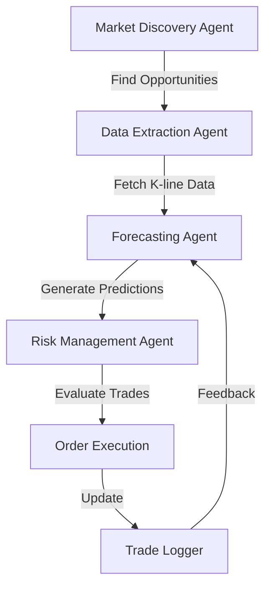

# megatron Agentic Trading System

## Overview
megatron is an agentic AI trading system designed for cryptocurrency prediction markets. It integrates multiple specialized agents to discover trading opportunities, analyze market data, generate AI-powered forecasts, and make data-driven trading decisions using the Kelly Criterion for optimal position sizing.

## Key Features
- **Multi-Agent Architecture**: Specialized agents for data extraction, market discovery, forecasting, and risk management
- **AI-Powered Forecasting**: Integrated Kronos model for accurate price movement predictions
- **Optimal Risk Management**: Kelly Criterion-based position sizing with fractional Kelly and exposure limits
- **Real-Time Market Data**: Connects to Polymarket and Kalshi prediction markets via their APIs
- **Historical Data Processing**: Fetches and processes crypto K-line data from Apify actors
- **Modular Design**: Clean separation of concerns with extensible agent interfaces
- **Comprehensive Logging**: Structured logging with console, file, and CSV outputs for trade analysis

## System Architecture


### Agent Responsibilities
1. **Market Discovery Agent**
   - Scans Polymarket and Kalshi for live BTC/ETH prediction markets
   - Extracts market-implied probabilities from market prices
   - Identifies trading opportunities with sufficient liquidity

2. **Data Extraction Agent**
   - Retrieves historical K-line data via Apify (buzzing_gear/crypto-market-intelligence)
   - Processes data into pandas DataFrames with standard OHLCV format
   - Handles multiple timeframes (1m, 5m, 15m, etc.)

3. **Forecasting Agent**
   - Integrates NVIDIA's Kronos AI model for time series forecasting
   - Respects model context window limits (max 512 bars)
   - Outputs directional probabilities (up/down movement likelihood)

4. **Risk Management Agent**
   - Implements Kelly Criterion for optimal position sizing
   - Applies fractional Kelly (default 0.25) to reduce variance
   - Enforces maximum exposure limits (default 30% of bankroll)
   - Provides clear TRADE/DO_NOT_TRADE decisions with reasoning

## Installation & Setup

### Prerequisites
- Python 3.12+
- Git
- API keys for:
  - Apify (for crypto-market-intelligence actor)
  - Polymarket (optional, for market discovery)
  - Kalshi (optional, for market discovery)

### Step-by-Step Setup
1. **Clone the repository**
```bash
git clone https://github.com/IshwikVashishtha/tradingbot.git
cd tradingbot
```

2. **Install dependencies using uv**
```bash
uv pip install -e .
```

3. **Configure environment variables**
Create a `.env` file in the project root:
```env
# Required
APIFY_API_KEY=your_apify_api_key_here

# Optional (for live market data)
POLYMARKET_API_KEY=your_polymarket_api_key_here
KALSHI_API_KEY=your_kalshi_api_key_here

# Trading parameters
MAX_CONTEXT=512
KELLY_FRACTION=0.25
MAX_EXPOSURE=0.30
```

4. **Verify installation**
```bash
uv run python -c "import megatron_trading_bot; print('Installation successful')"
```

## Usage

### Running the Trading System
Execute the main orchestration script:
```bash
uv run python main.py
```

### Expected Output
The system will:
1. Discover live prediction markets from Polymarket/Kalshi
2. Fetch historical K-line data for selected assets
3. Generate price movement predictions using Kronos AI
4. Evaluate trade viability using Kelly Criterion
5. Log all decisions and outcomes to CSV/file logs

Sample log output:
```
🚀 Starting megatron Agentic Trading System
============================================================

📊 Step 1: Discovering Live Prediction Markets
2026-07-02 15:52:15.893 | INFO     | agents.market_agent:find_live_markets:9 - Market Agent discovering live markets...
2026-07-02 15:52:15.896 | INFO     | tools.market_discovery:discover_markets:46 - Total markets discovered: 2
2026-07-02 15:52:15.898 | INFO     | __main__:main:27 - Implied Probability: 60.00%

📈 Step 2: Fetching Historical K-Line Data
2026-07-02 15:52:15.907 | INFO     | tools.apify_scraper:fetch_crypto_klines:37 - Successfully fetched 1000 bars for BTCUSDT
2026-07-02 15:52:15.915 | INFO     | agents.data_agent:get_historical_data:18 - Data Agent returning 1000 points

🔮 Step 3: Predicting Price Movement
2026-07-02 15:52:15.921 | INFO     | tools.kronos_predictor:__init__:16 - Initializing Kronos on device: cpu
2026-07-02 15:52:15.923 | INFO     | tools.kronos_predictor:preprocess_data:29 - Trimmed data to 512 bars
2026-07-02 15:52:15.923 | INFO     | tools.kronos_predictor:predict:57 - Prediction complete: up with 55.45% up probability

⚖️ Step 4: Evaluating Trade with Kelly Criterion
2026-07-02 15:52:15.926 | INFO     | agents.risk_agent:evaluate_trade:14 - Risk Agent evaluating trade...
2026-07:15.926 | INFO     | tools.kelly_criterion:calculate_kelly: Kelly calculation complete - Decision: TRADE
2026-07-02 15:52:15.926 | INFO     | agents.risk_agent:evaluate_trade: Trade approved - Position size: $272.54

✅ Trading System Execution Complete
============================================================
```

## Project Structure
```
megatron-trading-bot/
├── agents/                 # Specialized trading agents
│   ├── __init__.py
│   ├── data_agent.py       # Apify data extraction
│   ├── forecasting_agent.py # Kronos AI forecasting
│   ├── market_agent.py     # Polymarket/Kalshi discovery
│   └── risk_agent.py       # Kelly Criterion risk management
│
├── tools/                  # Utility modules and integrations
│   ├── __init__.py
│   ├── apify_scraper.py    # Apify actor wrapper
│   ├── kelly_criterion.py  # Kelly Criterion calculations
│   ├── kronos_predictor.py # Kronos model integration
│   └── market_discovery.py # Polymarket & Kalshi API clients
│
├── config/                 # Configuration files
│   ├── __init__.py
│   ├── constants.py        # Environment variables & constants
│   └── logger.py           # Loguru logging configuration
│
├── data/                   # Data storage
│   ├── __init__.py
│   └── logs/               # Trading logs and history
│       ├── megatron_trading_YYYY-MM-DD.log
│       └── trades_YYYY-MM-DD.csv
│
├── .env                    # Environment variables (not tracked)
├── .gitignore
├── main.py                 # Main orchestration script
├── project.md              # Detailed implementation plan
├── pyproject.toml          # Project metadata & dependencies
├── README.md               # This file
└── uv.lock                 # Dependency lock file
```

## Technologies Used
- **Language**: Python 3.12+
- **Dependency Management**: uv (ultra-fast Python package installer)
- **AI/Model**: NVIDIA Kronos (NeoQuasar/Kronos-small) for time series forecasting
- **Data Extraction**: Apify platform (buzzing_gear/crypto-market-intelligence actor)
- **Market Data**: Polymarket Gamma API & Kalshi Elections API
- **Math/Statistics**: NumPy, Pandas for data manipulation
- **Deep Learning**: PyTorch for model inference
- **HTTP Clients**: httpx for async API requests
- **Logging**: Loguru for structured, multi-output logging
- **Environment**: python-dotenv for secure configuration management

## Configuration Parameters
Key parameters configurable via `.env`:
- `MAX_CONTEXT`: Maximum bars fed to Kronos model (default: 512)
- `KELLY_FRACTION`: Fraction of Kelly criterion to apply (default: 0.25)
- `MAX_EXPOSURE`: Maximum bankroll allocation to active trades (default: 0.30)
- `APIFY_API_KEY`: Required for historical data extraction
- `POLYMARKET_API_KEY`: Optional for live Polymarket data
- `KALSHI_API_KEY`: Optional for live Kalshi data


## Contributing
1. Fork the repository
2. Create a feature branch (`git checkout -b feature/amazing-feature`)
3. Commit your changes (`git commit -m 'Add amazing feature'`)
4. Push to the branch (`git push origin feature/amazing-feature`)
5. Open a Pull Request

---